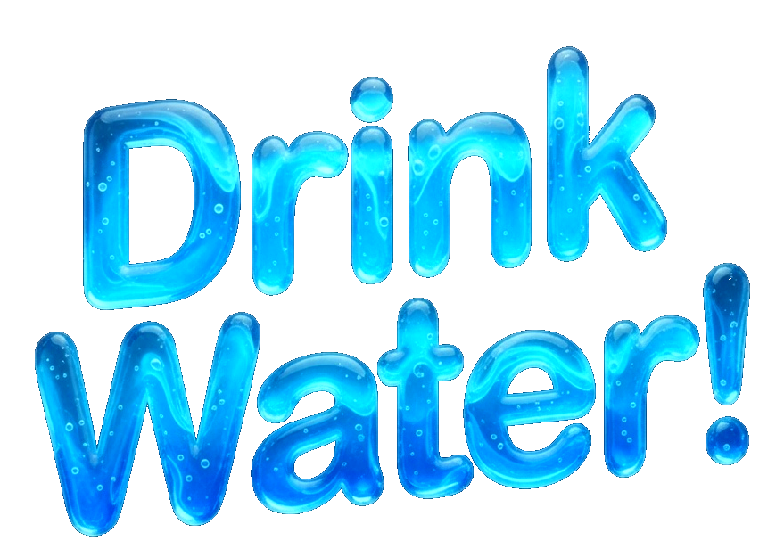

# 💧 Hydration Reminder

<div align="center">
  
  <p><i>A sleek, modern, and rock-solid hydration tracker for your desktop.</i></p>
  
  <a href="https://github.com/Chimthuwu/drink_water.git"><b>View Repository</b></a>
</div>

---

## 📸 Screenshots

### 🎯 Live Countdown Timer


### 🔔 Smart Alert Popup


### ⚙️ Customizable Settings


---

## ✨ Features
- **🎯 Persistent Timer**: High-visibility live countdown window.
- **🎨 Modern Design**: Consistent, frameless "Sleek Blue" UI across all screens.
- **🧘 Focus Mode**: Dismisses reminders automatically after a quick chime to keep you in the zone.
- **🎵 Multi-Tone Audio**: Choose between original beeps or soothing water drops.
- **⚙️ Customizable**: Change intervals, reminder text, and custom images via settings.
- **🚀 Background Support**: Closing windows keeps the app alive in the system tray.

## 📦 Getting Started

### Prerequisites
- [Node.js](https://nodejs.org/) installed on your machine.

### Installation & Development
```bash
# Clone the repository
git clone https://github.com/Chimthuwu/drink_water.git
cd drink_water

# Install dependencies
npm install

# Run the app locally
npm start

# Build your own portable executable (.exe)
npm run dist
```

## 🛠️ Technical Stack
- **Engine**: Electron (Chromium + Node.js)
- **UI**: Vanilla HTML5 / Modern CSS
- **Build**: Electron-Builder

---
<div align="center">
  <sub>Stay healthy, stay hydrated!</sub>
</div>
